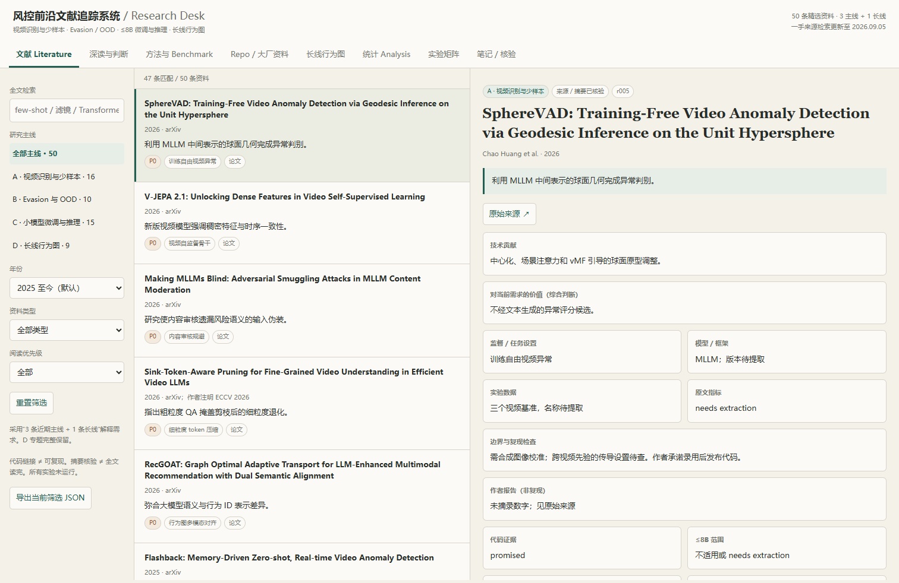

# 风控前沿文献追踪系统

[](https://github.com/bboylyg/Risk-Video-Frontier-Literature/actions/workflows/pages.yml)

面向视频风控研究的可视化文献工作台，聚焦 2025 年至今的论文、官方代码仓库和国外大厂技术资料，并保留必要的历史基础文献。

在线访问：[Risk Video Frontier Literature](https://bboylyg.github.io/Risk-Video-Frontier-Literature/)

[](https://bboylyg.github.io/Risk-Video-Frontier-Literature/)

## 研究范围

- 视频 Transformer 通用表示、异常视频识别、少样本动作与异常学习；
- 面向异常图像和视频的 evasion attack、黑产滤镜、图文干扰与 OOD；
- 8B 以内多模态模型的参数高效微调、量化、视觉 token 压缩与推理；
- 长期用户行为图、GraphLLM，以及行为结构与多模态内容表示的映射。

当前数据库收录 50 条精选资料。页面中的数量由本地数据计算；未知信息使用 `needs extraction`、`unknown` 或 `TBD` 标记。作者报告、本地复现结果和研究判断相互区分。

## 页面能力

- 按方向、年份、资料类型、优先级和关键词筛选；
- 查看论文贡献、实验设置、代码状态、证据位置和适用边界；
- 阅读跨论文方法分析、可比评测协议和复现检查项；
- 查看 Repo／大厂资料、长期行为图专题和实验矩阵；
- 在浏览器保存个人笔记并导出 JSON 或 Markdown。

个人笔记仅保存在当前浏览器，不会同步到 GitHub 或其他访问者。多人协作请通过 Issues 或 Pull Requests 完成。

## 项目结构

```text
index.html                         GitHub Pages 入口（构建生成）
INDEX.html                         本地离线入口（构建生成）
data/papers.json                   当前文献数据库，唯一编辑入口
data/research-synthesis.json       方向综合、深读和评测协议
src/research-desk.html             页面模板
literature/refocused/              单篇结构化笔记
literature/refocused-survey.md     完整调研报告
literature/search-provenance-*.md  检索范围和证据记录
scripts/build_desk.py              构建入口
scripts/validate_desk.py           数据与页面验证入口
```

## 每周更新

1. 在 `data/papers.json` 中增加或修订条目，并记录主来源、核验状态和更新时间。
2. 如需更新跨论文判断，修改 `data/research-synthesis.json`。
3. 运行构建与验证：

```bash
python scripts/build_desk.py
python scripts/validate_desk.py
```

4. 提交并推送到 `main`。GitHub Actions 会重新构建、验证并发布 Pages，访问地址保持不变。

也可以直接在 GitHub 网页编辑 JSON 后提交；Actions 会自动生成页面和单篇笔记。JSON 必须保持合法格式。

## 证据和复现规则

- 优先使用论文原文、会议页面、作者项目页、官方仓库和官方技术博客；
- 搜索摘要不能用于升级论文录用状态；
- 代码链接只代表入口已确认，不代表成功复现；
- 不同监督设置、攻击预算、数据切分和硬件上的数字不直接横向比较；
- 当前没有本地模型训练或性能复现，所有本地实验字段保持 `TBD`。

完整方法分析见 [调研报告](literature/refocused-survey.md)，检索与核验过程见 [来源记录](literature/search-provenance-2026-09-05.md)。

## 贡献

欢迎通过 Issues 推荐论文、报告错误或提出研究问题；通过 Pull Requests 修改数据库时，请遵循 [贡献指南](CONTRIBUTING.md)。

本仓库暂未附加开源许可证。页面可公开阅读；复制、再发布或创建衍生版本前请联系仓库所有者。
